# Kaana Foods — Phase-wise progress (Steps 3–15)

This document summarizes **what has been built and validated** in the Kaana Foods restaurant platform, organized by the internal **Step** milestones used in `scripts/step*-validate*` and `docs/validation/`. It is intended for onboarding, release planning, and audit handoff.

**Repository:** [restaurant-pos](https://github.com/Srinivas-2906/restaurant-pos)  
**Latest major delivery:** Step 15 offline POS (branch `feature/step15-offline-pos`, [PR #3](https://github.com/Srinivas-2906/restaurant-pos/pull/3) at time of writing)

---

## How to read this doc

| Column meaning | |
|----------------|--|
| **Status** | `Done` = automated validation exists and passed in repo artifacts; `Done (code)` = implemented, manual/device proof partial; `Partial` = in progress |
| **Validate** | Script or doc to re-run checks |

Steps **1–2** are not named as separate validation folders in this repo; they correspond to the **baseline monorepo** (Nest API, Prisma, Docker, core web apps, seed) that predates `step3-validate.ps1`. Everything below assumes **Demo Restaurant / MAIN outlet** after `npm run db:seed`.

---

## High-level roadmap

```mermaid
flowchart LR
  subgraph foundation [Foundation]
    A[Monorepo + API + DB seed]
    B[GCP Cloud Run optional]
  end
  subgraph platform [Platform 3–5]
    C[Capabilities + HQ admin]
    D[Operations web gating]
    E[Terminals + PIN auth]
  end
  subgraph mobile [Mobile 6–9]
    F[kaana-mobile shells]
    G[Management APIs]
    H[Online POS + Captain]
  end
  subgraph floor [Floor ops 10–11]
    I[KDS]
    J[System E2E matrix]
  end
  subgraph backoffice [Back office 12–14]
    K[Inventory + PO]
    L[Double-entry GL]
    M[Money module]
  end
  subgraph offline [Offline 15]
    N[SQLite POS + sync batch]
  end
  foundation --> platform --> mobile --> floor --> backoffice --> offline
  offline --> O[Step 16+ not started]
```

---

## Foundation (pre–Step 3)

**Goal:** Runnable India-first restaurant stack in a Turborepo with shared packages and demo data.

**Delivered**

| Area | What exists |
|------|-------------|
| **API** | `apps/api` — NestJS REST, WebSocket events, Swagger at `/api/docs` |
| **Data** | `packages/database` — Prisma schema, migrations, deterministic seed (Demo Restaurant, 6 tables, 12 menu items, staff, terminals) |
| **Web consoles** | `operations-web` (3010), `hq-admin` (3000), `pos-web`, `kds-web`, `captain-web`, others |
| **Shared UI** | `packages/ui`, `packages/role-shells`, Tailwind presets |
| **Local infra** | Docker Compose (Postgres/Redis), `outlet-hub` reference offline hub (4100) |
| **Cloud** | GCP Cloud Run deploy path — see [docs/gcp-cloud-run.md](./gcp-cloud-run.md) |

**Status:** Done (baseline for all later steps)

---

## Step 3 — Platform, capabilities, and auth boundaries

**Goal:** Multi-tenant platform admin, tenant **operating modes**, **module/feature capabilities**, and strict separation between **HQ admin**, **owner/manager JWT**, and **operational terminal + PIN** identities.

**Delivered**

- Platform API: tenant list/detail, config PATCH with **configVersion** bumps
- **Capabilities** service: `/capabilities/me` drives nav and feature flags (SIMPLE / STANDARD, module overrides, feature overrides)
- Auth guards: operational staff cannot access platform tenant APIs; role/outlet scoping
- HQ admin UI surfaces for tenant management

**Key paths**

- `apps/api/src/platform/`, `apps/api/src/capabilities/`
- `apps/hq-admin/`
- `packages/shared-types/src/capabilities.ts`

**Validate:** `powershell -File scripts/step3-validate.ps1` (API at `localhost:4000`)

**Status:** Done

---

## Step 4 — Operations web capability enforcement

**Goal:** **operations-web** respects live capability config (disable inventory, procurement, payroll, granular features like `inventory.stock_transfer`).

**Delivered**

- Capability-aware routing and UI (`CapabilityRouteGuard`, contexts)
- Owner/manager experience on unified console (3010)
- Admin can toggle modules; owner sees updated nav after configVersion change

**Key paths**

- `apps/operations-web/src/contexts/`, `CapabilityRouteGuard.tsx`
- Finance/setup/signup flows added in later steps but gated here

**Validate:** `powershell -File scripts/step4-validate.ps1`

**Status:** Done

---

## Step 5 — Device registration, activation, terminal auth

**Goal:** Production-style **device lifecycle**: register terminal → activation code → device credential → **Terminal** auth header → eligible staff → **PIN login** with role/device rules.

**Delivered**

- Terminals CRUD, activation codes, revoke/heartbeat patterns
- `Authorization: Terminal {id}:{secret}` for operational endpoints
- PIN login issues operational JWT; wrong device / wrong role denied (e.g. chef on captain)
- Seeded devices: **POS-01**, **CAPTAIN-01**, **KDS-01** with dev secrets documented in Step 11 matrix

**Key paths**

- `apps/api/src/terminals/`, `apps/api/src/auth/operational-auth.*`
- Web: `PosTerminalSetup`, `CaptainTerminalSetup`, `KdsTerminalSetup` (pos/kds/captain web + mobile)

**Validate:** `powershell -File scripts/step5-validate.ps1`

**Status:** Done

---

## Step 6 — Kaana Mobile unified app foundation

**Goal:** Single Expo app (`apps/kaana-mobile`) hosting **Management**, **POS**, **Captain**, and **KDS** shells with shared activation, operational login, and `@kaana/api-client`.

**Delivered**

- Expo Router layouts: `app/management/*`, `app/pos/*`, `app/captain/*`, `app/kds/*`, `app/activate`, `app/operational/login`
- SecureStore for terminal credential; in-memory PIN session policy
- Shared operational API client patterns
- Android build scripts (`android-env.ps1`, `build-device-apk.ps1`)
- Unit tests for permissions, activation errors, navigation

**Key paths**

- `apps/kaana-mobile/` (entire app)
- `packages/api-client/`

**Validate:** `powershell -File scripts/step6-validate.ps1`  
**Docs:** [apps/kaana-mobile/README.md](../apps/kaana-mobile/README.md)

**Status:** Done

---

## Step 7 — Management mobile (owner/manager back office on device)

**Goal:** Mobile management tabs call the same APIs as operations-web for dashboard, orders, inventory summary, staff, devices, purchases.

**Delivered**

- Management provider, dashboard hook, money/inventory/orders/more tabs
- Billing, devices, expenses, reports, staff screens (MVP depth)
- API validation for owner vs manager access

**Key paths**

- `apps/kaana-mobile/app/management/`
- `apps/kaana-mobile/src/management/`

**Validate:** `powershell -File scripts/step7-validate.ps1`

**Status:** Done

---

## Step 8 — Online POS flows (API + mobile POS shell)

**Goal:** End-to-end **online** POS: takeaway/dine-in order lifecycle, items, tax/totals, settle, inventory side-effects, operational JWT from POS terminal.

**Delivered**

- Mobile POS screens: home, order, payment, receipt, tables, open orders (online-first before Step 15)
- `pos-web` parity for browser fallback
- API scenarios: owner takeaway, EMP001 terminal takeaway, dine-in, settle, stock movement checks

**Key paths**

- `apps/kaana-mobile/app/pos/`
- `apps/api/src/orders/`

**Validate:** `powershell -File scripts/step8-validate.ps1`

**Status:** Done (online); extended by Step 15 for offline

---

## Step 9 — Captain dine-in flow (API + Android UI)

**Goal:** **Captain** table service: floor → menu → cart → KOT → kitchen state → POS coordination → serve → bill → settle; device UI walkthrough on Android.

**Delivered**

- Captain mobile/web: tables, order, ready screens
- API E2E: EMP002 on captain terminal, table order, KOT, POS visibility, settlement path
- Automated UI walkthrough scripts (UIAutomator / coordinates) with screenshot archive under `docs/validation/step9-ui/`

**Key paths**

- `apps/kaana-mobile/app/captain/`
- `apps/captain-web/`
- `scripts/step9-ui-walkthrough.ps1`, `step9-ui-captain-flow.ps1`

**Validate:** `powershell -File scripts/step9-validate.ps1`

**Status:** Done

---

## Step 10 — Kitchen Display System (KDS)

**Goal:** KDS queue, ticket lifecycle (new → in progress → ready), enforcement when KDS module disabled, Android manual validation.

**Delivered**

- KDS API scenarios A–I (multi-KOT, idempotency, captain/POS order paths)
- KDS mobile + `kds-web` with operational login and realtime
- Manual procedures: `docs/validation/step10-kds-human/`, screenshot folders under `docs/validation/step10-kds/`
- Capability enforcement script for disabled KDS module

**Key paths**

- `apps/api/src/kds/`
- `apps/kaana-mobile/app/kds/`
- `apps/kds-web/`

**Validate:**  
- API: `powershell -File scripts/step10-validate.ps1`  
- Manual: `docs/validation/step10-kds-human/PROCEDURE.md`

**Status:** Done

---

## Step 11 — Full-system operational E2E matrix

**Goal:** One scripted pass over **identity matrix**, **device matrix**, dine-in + KOT + POS settle + permissions + audit + IDOR checks on a **deterministic seed baseline**.

**Delivered**

- `scripts/step11-system-e2e.ps1`
- Recorded results: [docs/validation/step11/e2e-results.json](./validation/step11/e2e-results.json) (all tests passing in committed snapshot)
- Matrix doc: [docs/validation/step11/MATRIX.md](./validation/step11/MATRIX.md)

**Coverage highlights (from e2e-results)**

- Role/device PIN rules (cashier POS, captain, chef KDS)
- Captain order → KOT → KDS ready → POS settle → table free
- Settlement idempotency, cancel frees table
- Cashier discount denied / owner discount allowed
- Reports sales endpoint, operational audit attribution, IDOR denied

**Status:** Done

---

## Step 12 — Inventory and procurement

**Goal:** Authoritative stock ledger, commitments, purchase orders, GRN/receive, WAC costing, transfers, wastage — integrated with orders/KOT consumption.

**Delivered**

- Inventory domain in API with ledger invariants
- Operations-web inventory/purchases modules
- E2E script: `scripts/step12-inventory-e2e.ps1`
- Architecture: [docs/validation/step12/ARCHITECTURE.md](./validation/step12/ARCHITECTURE.md)

**Status:** Done

---

## Step 13 — Double-entry accounting (GL)

**Goal:** Posted journals as **source of truth** for finance; map settlements, COGS, GRN, AP, expenses, transfers to balanced entries with idempotency.

**Delivered**

- `apps/api/src/accounting/` — chart of accounts, posting queue, business-day semantics
- Operations-web finance routes: journal, trial balance, P&amp;L, balance sheet, accounts
- Tests + E2E: `scripts/step13-accounting-e2e.ps1`, seed idempotency check
- Architecture: [docs/validation/step13/ARCHITECTURE.md](./validation/step13/ARCHITECTURE.md)

**Status:** Done

---

## Step 14 — Money and financial operations (mobile + console)

**Goal:** Owner-facing **money** workflows on mobile and web: activity, P&amp;L, balance sheet, supplier dues, owner capital/drawings — backed by Step 13 GL.

**Delivered**

- Mobile money screens under `apps/kaana-mobile/app/management/money/`
- E2E: `scripts/step14-money-e2e.mjs` / `.ps1`

**Status:** Done

---

## Step 15 — Production offline-first POS

**Goal:** **Local-first POS** on Android: SQLite cache + durable outbox, offline PIN, offline order/KOT/settle, background sync to cloud via **`POST /sync/pos/batch`**, without redesigning Step 12/13 server authority.

**Delivered (code)**

| Component | Description |
|-----------|-------------|
| **Local DB** | expo-sqlite schema: menu, floor, orders, KOTs, payments, outbox, id_map, migrations |
| **Outbox** | Persistent commands with idempotency keys; states pending/syncing/acked/failed; stale `syncing` recovery |
| **Sync worker** | Health probe (no JWT refresh loop), batch push with real operational JWT |
| **Offline auth** | Staff snapshot + offline PIN session (`offline-session` — **cannot sync** until online PIN login) |
| **UX fixes** | Cache-first menu with timeouts; tables/open orders offline fallback; stable connectivity banner (hysteresis) |
| **POS UI** | Sync status screen, pending sale cards, offline receipt from SQLite |
| **Server** | `pos-sync.service.ts` — command ack, server ID mapping, settle idempotency, conflicts table |
| **Protocol** | Extended `@kaana/sync-protocol` with POS command types |
| **Tests** | `apps/kaana-mobile` unit tests (menu refresh, connectivity, persistence, outbox display); API pos-sync specs |
| **Tooling** | `step15-offline-pos-e2e.mjs`, device SQLite inspect scripts, APK build script |

**Architecture:** [docs/validation/step15/ARCHITECTURE.md](./validation/step15/ARCHITECTURE.md)  
**Testing guide:** [docs/validation/step15/TESTING.md](./validation/step15/TESTING.md)  
**Manual walkthrough:** [docs/validation/step15/android/PROCEDURE.md](./validation/step15/android/PROCEDURE.md)

**Validation status (honest)**

| Check | Status |
|-------|--------|
| Unit tests (`npm test` in kaana-mobile / api) | Done (code) |
| API-level offline sync simulation | Done (script) |
| Physical tablet: online cache + offline menu | Done (device) |
| Physical tablet: offline settle + SQLite persistence after force-stop | Done (device) |
| Full screenshot set + cloud sync after reconnect with **online PIN** | Partial — requires operator step (Switch Employee → EMP001 online) |
| Step 15 definition-of-done checklist in TESTING.md | Partial |

**Explicitly out of scope (Step 16+)**

- Live KDS tickets while fully offline (KOT queued until sync)
- Authoritative offline inventory / GL on device
- Extended conflict UI beyond stored `sync_conflicts`

**Status:** **Done (code)** — **Partial (full device sign-off)**

---

## Cross-cutting packages (used across phases)

| Package | Role |
|---------|------|
| `@kaana/database` | Prisma models for orders, inventory, accounting, devices, sync commands |
| `@kaana/api-client` | Typed HTTP client for mobile/web |
| `@kaana/sync-protocol` | Envelopes, POS command types, conflict rules |
| `@kaana/sync-engine` | Web outbox helpers; mobile implements persistent store in SQLite |
| `@kaana/ui` | Shared login shells, `RoleAppShell`, operational forms |
| `@kaana/shared-types` | Permissions, capabilities |

---

## Validation script index

| Step | Command |
|------|---------|
| 3 | `scripts/step3-validate.ps1` |
| 4 | `scripts/step4-validate.ps1` |
| 5 | `scripts/step5-validate.ps1` |
| 6 | `scripts/step6-validate.ps1` |
| 7 | `scripts/step7-validate.ps1` |
| 8 | `scripts/step8-validate.ps1` |
| 9 | `scripts/step9-validate.ps1` (+ UI walkthrough scripts) |
| 10 | `scripts/step10-validate.ps1` (+ manual KDS scripts) |
| 11 | `scripts/step11-system-e2e.ps1` |
| 12 | `scripts/step12-inventory-e2e.ps1` |
| 13 | `scripts/step13-accounting-e2e.ps1` |
| 14 | `node scripts/step14-money-e2e.mjs` |
| 15 | `node scripts/step15-offline-pos-e2e.mjs` + [TESTING.md](./validation/step15/TESTING.md) |

**Prerequisites for all API scripts:** Docker up, `db:seed`, API on port 4000.

---

## Demo identities (quick reference)

From Step 11 matrix — use after seed:

| Surface | Identity | Credential |
|---------|----------|------------|
| Platform admin | admin@kaanafoods.in | password123 |
| Owner | owner@kaanafoods.in | password123 |
| Manager | manager@kaanafoods.in | password123 |
| Cashier (POS) | EMP001 | PIN 1111 |
| Captain | EMP002 | PIN 2222 |
| Chef (KDS) | EMP003 | PIN 3333 |
| Floor manager | EMP004 | PIN 4444 |

---

## Suggested next work (not started)

1. **Complete Step 15 sign-off** — online PIN sync, pending count → 0, archive `06-synced.png`, merge PR #3  
2. **Step 16** — offline/cloud KOT and KDS behavior (per ARCHITECTURE boundaries)  
3. **CI** — path-filter workflows for `kaana-mobile` tests on PRs touching mobile/offline  
4. **pos-desktop / outlet-hub** — align with mobile sync protocol or document split responsibilities  

---

## Document maintenance

When a step completes, update:

1. This file — **Status** column and validation artifacts  
2. `docs/validation/stepN/` — PROCEDURE, ARCHITECTURE, or results JSON  
3. Root [README.md](../README.md) if new apps or ports change  

*Last updated: 2026-09-28 — reflects Step 15 offline POS delivery on `feature/step15-offline-pos`.*
